# You Have The Con 
### NSS Backend Capstone

## Description:

An organizational app designed for "Cosplayers."  Cosplay is the act of dressing up as a character or concept. People who do it regularly are called "cosplayers". Cosplay fans typically will attend at least one if not several Cosplay Conventions, or "cons" as they are called, per year.  This app is a tool to help cosplayers organize that process.  Users can create a budget per con, track their expenses per con, create a schedule of events while attending a con, and track the progress of various outfits needed for a con.  The styling of the app gives a shout out to many of the different fandoms of cosplayers.  The home page uses a Star Trek interface as a backdrop.  The budgeting page is an homage to wizards with old parchment paper and a handwritten font. The numerous add forms in the app pay homage to Star Wars, Lord of the Rings, and Game Of Thrones as well. 

## Technologies:
* ReactJs
* ASP.NetCore
* T-SQL
* C#

## Walk Through

Home Page -- An interface from the Star Trek series
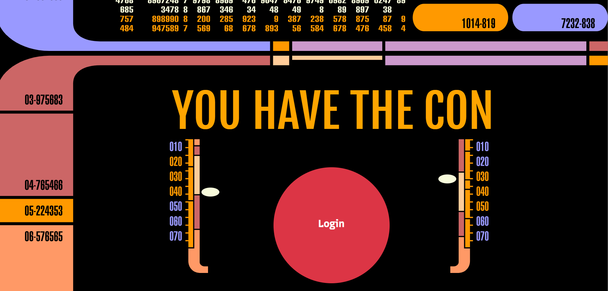

Logged In Page

AllCons Page -- user can view all of the cons they are planning to attend.  User can also add or delete (delete button on hover) a con to this page. Cons are listed by upcoming date. Background is an old castle wall.
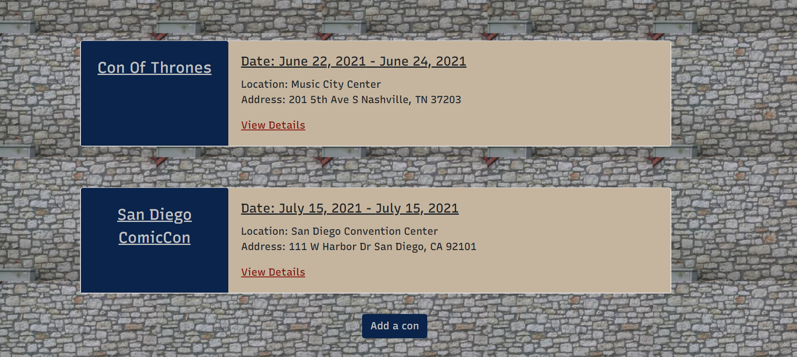

Add A Con  -- user can add a con. Background homage to Star Wars death star.
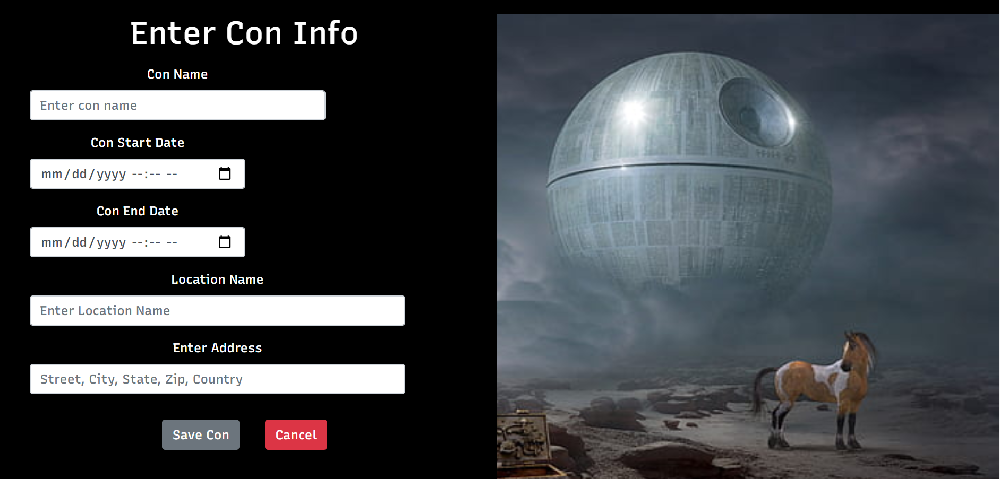

Single Con Page / Budget Portion --
* User can create or view their budget for the chosen con.  If no budget exists the user is prompted to create one.  There is only one budget allowed per con.  
* User can add / edit / delete categories in the budget.  The budget  will calculate your remaining funds based on the available funds entered when creating the budget.
The edit and delete buttons appear on hover in the line items. 
* Styling pays homage to Harry Potter fans 

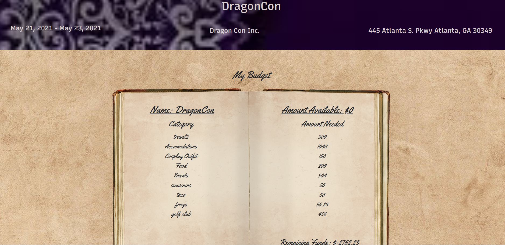

Add a Category form

SingleCon / Expenses
* User can add / edit / delete their expenses incurred at the con and compare them to the amount they budgeted for them.  Category names in dropdown are pulled in from the budget categories.
* Edit / delete appear on line items on mouse hover.
* Bottom Link links to the con schedule page where a user can track the events they are attending.
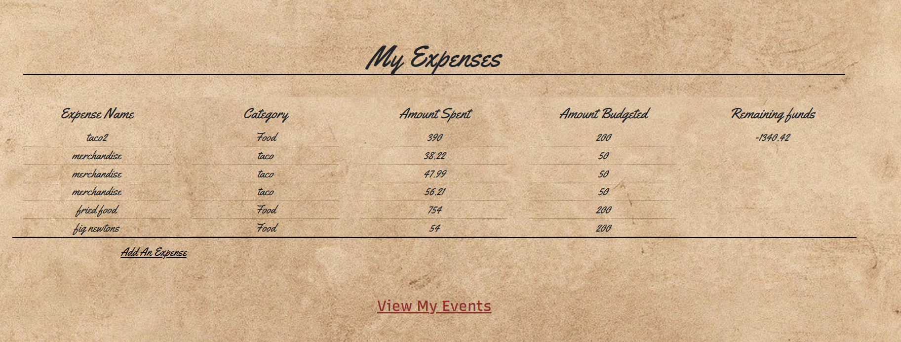

Add An Expense Form

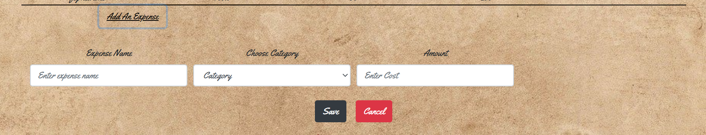

Con Schedule Page
* User can create an at a glance schedule for their activities at the con.
* Events appear in chronological order.
* User can add / edit / delete events.  Edit / delete appear on hover per line item.

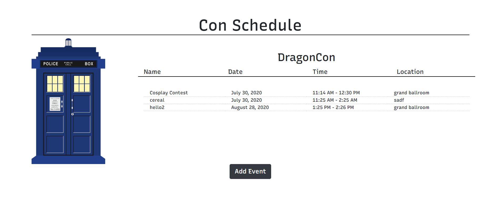

Add Event Form

AllCosplays Page
* User can view the outfits they would like to make or purchase and also add a cosplay.

Add A Cosplay Form
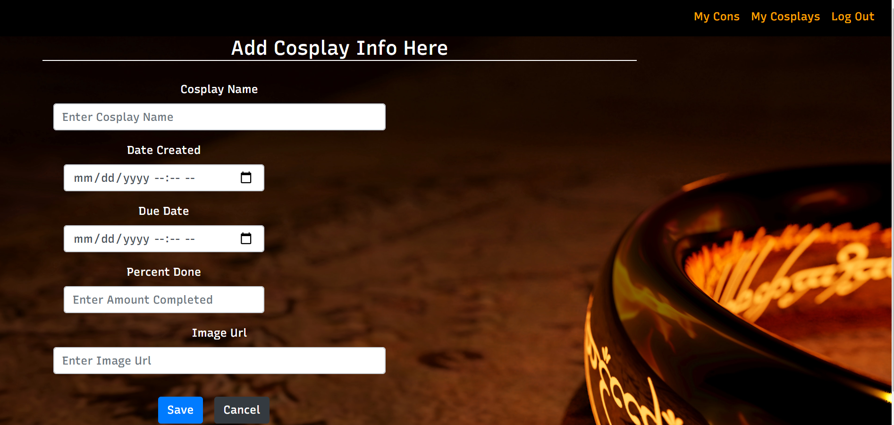

Cosplay Pieces Page
* User can add and track progress of the various pieces that make up one outfit.
* User can create and delete todo tasks to help organize the creation process.

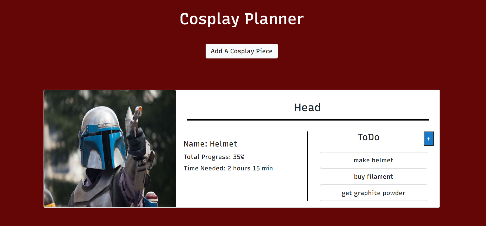

Add Cosplay Piece Form
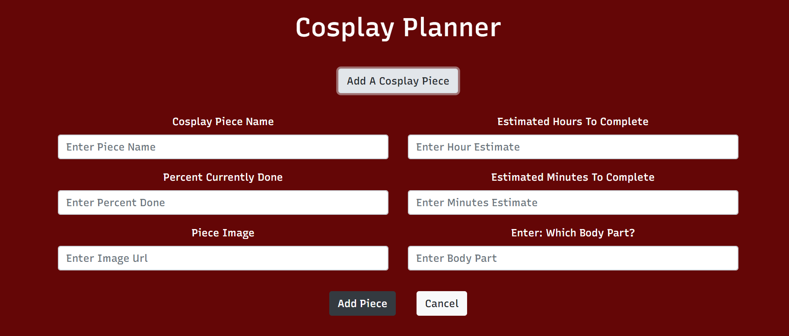

Add ToDo Form
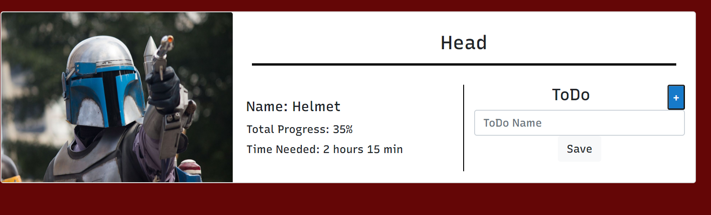

## Contributors

* Denise Baker

